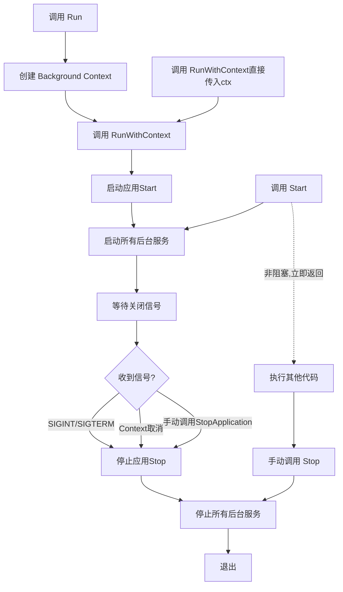

# 主机和生命周期管理 (Hosting)

[← 返回主目录](../README.md)

Hosting 模块提供了应用程序的主机管理和生命周期控制功能，包括后台服务、启动/关闭管理、环境配置等。

## 特性

- ✅ 应用程序生命周期管理
- ✅ 后台服务（IHostedService）
- ✅ 优雅关闭（Graceful Shutdown）
- ✅ 环境管理（Development/Production）
- ✅ 应用程序启动/停止事件
- ✅ 自动资源清理
- ✅ 信号处理（SIGINT/SIGTERM）

## 快速开始

### 1. 基本使用

CSGO Web 应用已自动集成 Host 管理，无需手动创建：

```go
package main

import "github.com/gocrud/csgo/web"

func main() {
    builder := web.CreateBuilder()
    app := builder.Build()
    
    // Run 会自动处理生命周期
    app.Run()  // 阻塞直到收到关闭信号
}
```

### 2. 注册后台服务

```go
package main

import (
    "context"
    "fmt"
    "time"
    
    "github.com/gocrud/csgo/hosting"
    "github.com/gocrud/csgo/web"
)

// 定义后台服务
type MyBackgroundWorker struct {
    *hosting.BackgroundService
}

func NewMyBackgroundWorker() *MyBackgroundWorker {
    worker := &MyBackgroundWorker{
        BackgroundService: hosting.NewBackgroundService(),
    }
    worker.SetExecuteFunc(worker.doWork)
    return worker
}

func (w *MyBackgroundWorker) doWork(ctx context.Context) error {
    ticker := time.NewTicker(5 * time.Second)
    defer ticker.Stop()
    
    for {
        select {
        case <-ticker.C:
            fmt.Println("Background worker: doing work...")
        case <-w.StoppingToken():
            fmt.Println("Background worker: stopping...")
            return nil
        case <-ctx.Done():
            return ctx.Err()
        }
    }
}

func main() {
    builder := web.CreateBuilder()
    
    // 注册后台服务
    builder.Services.AddHostedService(NewMyBackgroundWorker)
    
    app := builder.Build()
    app.Run()  // 应用运行时后台服务自动启动
}
```

## IHost 接口

### Host 生命周期

```go
type IHost interface {
    // 获取服务容器
    Services() di.IServiceProvider
    
    // 启动主机
    Start(ctx context.Context) error
    
    // 停止主机
    Stop(ctx context.Context) error
    
    // 运行主机（阻塞）
    Run() error
    
    // 使用 Context 运行主机（阻塞）
    RunWithContext(ctx context.Context) error
}
```

### 运行应用

IHost 提供了三种运行应用的方式，它们的**阻塞特性和使用场景**各不相同：

#### 方式对比

| 方法 | 是否阻塞 | Context 来源 | 适用场景 |
|------|---------|-------------|----------|
| `Run()` | ✅ 阻塞 | 自动创建（Background） | 标准 Web 应用（推荐） |
| `RunWithContext(ctx)` | ✅ 阻塞 | 自定义传入 | 需要通过 Context 控制取消/超时 |
| `Start() + Stop()` | ❌ 非阻塞 | 自定义传入 | 需要在启动后执行其他代码 |

> **💡 提示**：`RunWithContext` 与 `Run()` 一样都是阻塞的，会一直运行直到收到关闭信号。唯一区别是 `RunWithContext` 可以传入自定义 Context 来控制取消或超时。

#### 底层实现关系

从源码可以看到，`Run()` 只是 `RunWithContext()` 的简化封装：

```go
// host.go
func (h *Host) Run() error {
    return h.RunWithContext(context.Background())
}
```

#### 执行流程



#### 使用示例

##### 方式 1：Run() - 标准 Web 应用（推荐）

```go
func main() {
    builder := web.CreateBuilder()
    app := builder.Build()
    
    // 最简单的方式：阻塞运行直到收到关闭信号
    app.Run()  // 自动处理 SIGINT (Ctrl+C) 和 SIGTERM
}
```

**适用场景**：大部分 Web 应用的标准使用方式。

##### 方式 2：RunWithContext(ctx) - Context 控制

```go
func main() {
    builder := web.CreateBuilder()
    app := builder.Build()
    
    // 使用带超时的 Context
    ctx, cancel := context.WithTimeout(context.Background(), 1*time.Hour)
    defer cancel()
    
    // 应用会运行，但 1 小时后自动关闭
    app.RunWithContext(ctx)
}
```

**适用场景**：
- 需要通过 Context 控制应用运行时长
- 需要在父 Context 取消时自动关闭应用
- 集成到更大的系统中，需要统一的 Context 控制

##### 方式 3：Start() + Stop() - 手动控制（高级）

```go
func main() {
    builder := web.CreateBuilder()
    app := builder.Build()
    
    ctx := context.Background()
    
    // 启动应用（非阻塞）
    if err := app.Start(ctx); err != nil {
        log.Fatal(err)
    }
    
    // 应用已启动，可以做其他事情
    fmt.Println("应用已启动，执行健康检查...")
    
    // 等待 5 秒确保服务就绪
    time.Sleep(5 * time.Second)
    
    // 执行健康检查
    if err := healthCheck(); err != nil {
        log.Println("健康检查失败，关闭应用")
        app.Stop(ctx)
        return
    }
    
    fmt.Println("应用运行中，按 Ctrl+C 停止...")
    
    // 等待关闭信号
    quit := make(chan os.Signal, 1)
    signal.Notify(quit, syscall.SIGINT, syscall.SIGTERM)
    <-quit
    
    // 手动停止应用
    fmt.Println("正在关闭应用...")
    if err := app.Stop(ctx); err != nil {
        log.Fatal(err)
    }
}
```

**适用场景**：
- 需要在启动后执行初始化或健康检查
- 需要在多个应用之间协调启动顺序
- 需要完全控制应用的生命周期

### 优雅关闭

应用会自动监听系统信号并执行优雅关闭：

```go
app.Run()  // 自动处理 SIGINT (Ctrl+C) 和 SIGTERM
```

**关闭流程：**

1. 收到关闭信号（SIGINT/SIGTERM）
2. 触发 ApplicationStopping 事件
3. 停止所有后台服务（逆序）
4. 清理资源
5. 触发 ApplicationStopped 事件
6. 退出应用

### 配置关闭超时

```go
builder := web.CreateBuilder()

// 设置关闭超时（默认 30 秒）
builder.WebHost.UseShutdownTimeout(60)  // 60 秒

app := builder.Build()
app.Run()
```

## IHostedService 接口

### 接口定义

```go
type IHostedService interface {
    // 应用启动时调用
    StartAsync(ctx context.Context) error
    
    // 应用停止时调用
    StopAsync(ctx context.Context) error
}
```

### 实现后台服务

#### 方式 1：继承 BackgroundService（推荐）

```go
type EmailWorker struct {
    *hosting.BackgroundService
    emailService *EmailService
}

func NewEmailWorker(emailService *EmailService) *EmailWorker {
    worker := &EmailWorker{
        BackgroundService: hosting.NewBackgroundService(),
        emailService:      emailService,
    }
    worker.SetExecuteFunc(worker.processEmails)
    return worker
}

func (w *EmailWorker) processEmails(ctx context.Context) error {
    ticker := time.NewTicker(10 * time.Second)
    defer ticker.Stop()
    
    for {
        select {
        case <-ticker.C:
            // 处理邮件队列
            w.emailService.ProcessQueue()
            
        case <-w.StoppingToken():
            // 收到停止信号
            fmt.Println("Email worker stopping...")
            return nil
            
        case <-ctx.Done():
            return ctx.Err()
        }
    }
}
```

#### 方式 2：直接实现接口

```go
type DataSyncService struct {
    syncService *SyncService
}

func NewDataSyncService(syncService *SyncService) *DataSyncService {
    return &DataSyncService{syncService: syncService}
}

func (s *DataSyncService) StartAsync(ctx context.Context) error {
    fmt.Println("Data sync service starting...")
    
    // 启动同步协程
    go s.runSync(ctx)
    
    return nil
}

func (s *DataSyncService) StopAsync(ctx context.Context) error {
    fmt.Println("Data sync service stopping...")
    
    // 清理资源
    return s.syncService.Cleanup()
}

func (s *DataSyncService) runSync(ctx context.Context) {
    ticker := time.NewTicker(1 * time.Minute)
    defer ticker.Stop()
    
    for {
        select {
        case <-ticker.C:
            s.syncService.Sync()
        case <-ctx.Done():
            return
        }
    }
}
```

### 注册后台服务

```go
builder := web.CreateBuilder()

// 注册后台服务
builder.Services.AddHostedService(NewEmailWorker)
builder.Services.AddHostedService(NewDataSyncService)

app := builder.Build()
app.Run()
```

### 后台服务执行顺序

- **启动**：按注册顺序启动
- **停止**：按注册顺序逆序停止（LIFO）

```go
builder.Services.AddHostedService(NewServiceA)  // 1. 启动，3. 停止
builder.Services.AddHostedService(NewServiceB)  // 2. 启动，2. 停止
builder.Services.AddHostedService(NewServiceC)  // 3. 启动，1. 停止
```

## BackgroundService 基类

### 使用 BackgroundService

BackgroundService 是实现长时间运行后台任务的基类：

```go
type MyWorker struct {
    *hosting.BackgroundService
    logger logging.ILogger
}

func NewMyWorker(loggerFactory logging.ILoggerFactory) *MyWorker {
    worker := &MyWorker{
        BackgroundService: hosting.NewBackgroundService(),
        logger:            logging.GetLogger[MyWorker](loggerFactory),
    }
    worker.SetExecuteFunc(worker.execute)
    return worker
}

func (w *MyWorker) execute(ctx context.Context) error {
    w.logger.LogInformation("Worker started")
    
    ticker := time.NewTicker(5 * time.Second)
    defer ticker.Stop()
    
    for {
        select {
        case <-ticker.C:
            w.doWork()
            
        case <-w.StoppingToken():
            w.logger.LogInformation("Worker stopping...")
            return nil
            
        case <-ctx.Done():
            return ctx.Err()
        }
    }
}

func (w *MyWorker) doWork() {
    w.logger.LogInformation("Doing work...")
    // 执行任务
}
```

### 停止信号（StoppingToken）

使用 `StoppingToken()` 监听停止信号：

```go
func (w *Worker) execute(ctx context.Context) error {
    for {
        select {
        case <-time.After(5 * time.Second):
            // 定期执行任务
            w.doSomething()
            
        case <-w.StoppingToken():
            // 收到停止信号，清理并退出
            w.cleanup()
            return nil
        }
    }
}
```

## 应用程序生命周期事件

### IHostApplicationLifetime

```go
type IHostApplicationLifetime interface {
    // 应用完全启动后关闭的通道
    ApplicationStarted() <-chan struct{}
    
    // 应用开始停止时关闭的通道
    ApplicationStopping() <-chan struct{}
    
    // 应用完全停止后关闭的通道
    ApplicationStopped() <-chan struct{}
    
    // 请求应用停止
    StopApplication()
}
```

### 监听生命周期事件

```go
type MyService struct {
    lifetime hosting.IHostApplicationLifetime
}

func NewMyService(lifetime hosting.IHostApplicationLifetime) *MyService {
    svc := &MyService{lifetime: lifetime}
    
    // 监听启动事件
    go func() {
        <-lifetime.ApplicationStarted()
        fmt.Println("Application has started!")
        // 执行启动后的任务
    }()
    
    // 监听停止事件
    go func() {
        <-lifetime.ApplicationStopping()
        fmt.Println("Application is stopping...")
        // 执行清理任务
    }()
    
    go func() {
        <-lifetime.ApplicationStopped()
        fmt.Println("Application has stopped!")
    }()
    
    return svc
}
```

### 手动请求停止

```go
type AdminService struct {
    lifetime hosting.IHostApplicationLifetime
}

func (s *AdminService) Shutdown() {
    // 触发应用关闭
    s.lifetime.StopApplication()
}
```

## 环境管理

### IHostEnvironment

```go
type IHostEnvironment interface {
    // 获取环境名称（Development、Production、Staging 等）
    GetEnvironmentName() string
    
    // 设置环境名称
    SetEnvironmentName(name string)
    
    // 是否为开发环境
    IsDevelopment() bool
    
    // 是否为生产环境
    IsProduction() bool
    
    // 是否为特定环境
    IsEnvironment(environmentName string) bool
}
```

### 使用环境

```go
builder := web.CreateBuilder()

// 访问环境信息
env := builder.Environment

if env.IsDevelopment() {
    // 开发环境配置
    builder.AddCors(func(opts *web.CorsOptions) {
        opts.AllowAllOrigins = true
    })
}

if env.IsProduction() {
    // 生产环境配置
    // 启用压缩、缓存等
}

// 自定义环境判断
if env.IsEnvironment("Staging") {
    // 预发布环境配置
}
```

### 设置环境

```bash
# 通过环境变量设置
export ENVIRONMENT=production
export ENVIRONMENT=development
export ENVIRONMENT=staging

# 运行应用
go run main.go
```

或在代码中设置：

```go
builder := web.CreateBuilder()
builder.Environment.SetEnvironmentName("production")
```

## 常见使用场景

### 1. 定时任务

```go
type ScheduledTask struct {
    *hosting.BackgroundService
}

func NewScheduledTask() *ScheduledTask {
    task := &ScheduledTask{
        BackgroundService: hosting.NewBackgroundService(),
    }
    task.SetExecuteFunc(task.run)
    return task
}

func (t *ScheduledTask) run(ctx context.Context) error {
    // 每天凌晨 2 点执行
    ticker := time.NewTicker(1 * time.Hour)
    defer ticker.Stop()
    
    for {
        now := time.Now()
        if now.Hour() == 2 && now.Minute() == 0 {
            t.executeTask()
        }
        
        select {
        case <-ticker.C:
            // 继续检查时间
        case <-t.StoppingToken():
            return nil
        case <-ctx.Done():
            return ctx.Err()
        }
    }
}

func (t *ScheduledTask) executeTask() {
    // 执行定时任务
    fmt.Println("Running scheduled task...")
}
```

### 2. 消息队列消费者

```go
type QueueConsumer struct {
    *hosting.BackgroundService
    queue *MessageQueue
}

func NewQueueConsumer(queue *MessageQueue) *QueueConsumer {
    consumer := &QueueConsumer{
        BackgroundService: hosting.NewBackgroundService(),
        queue:             queue,
    }
    consumer.SetExecuteFunc(consumer.consume)
    return consumer
}

func (c *QueueConsumer) consume(ctx context.Context) error {
    for {
        select {
        case msg := <-c.queue.Messages():
            c.processMessage(msg)
            
        case <-c.StoppingToken():
            fmt.Println("Queue consumer stopping...")
            return nil
            
        case <-ctx.Done():
            return ctx.Err()
        }
    }
}

func (c *QueueConsumer) processMessage(msg *Message) {
    // 处理消息
    fmt.Printf("Processing message: %v\n", msg)
}
```

### 3. 健康检查

```go
type HealthCheckService struct {
    *hosting.BackgroundService
    services []IHealthCheck
}

func NewHealthCheckService(services []IHealthCheck) *HealthCheckService {
    svc := &HealthCheckService{
        BackgroundService: hosting.NewBackgroundService(),
        services:          services,
    }
    svc.SetExecuteFunc(svc.check)
    return svc
}

func (s *HealthCheckService) check(ctx context.Context) error {
    ticker := time.NewTicker(30 * time.Second)
    defer ticker.Stop()
    
    for {
        select {
        case <-ticker.C:
            for _, svc := range s.services {
                if !svc.IsHealthy() {
                    fmt.Printf("Service %s is unhealthy!\n", svc.Name())
                }
            }
            
        case <-s.StoppingToken():
            return nil
            
        case <-ctx.Done():
            return ctx.Err()
        }
    }
}
```

### 4. 缓存预热

```go
type CacheWarmer struct {
    cacheService *CacheService
    lifetime     hosting.IHostApplicationLifetime
}

func NewCacheWarmer(
    cacheService *CacheService,
    lifetime hosting.IHostApplicationLifetime,
) *CacheWarmer {
    warmer := &CacheWarmer{
        cacheService: cacheService,
        lifetime:     lifetime,
    }
    
    // 监听应用启动事件
    go func() {
        <-lifetime.ApplicationStarted()
        warmer.warmup()
    }()
    
    return warmer
}

func (w *CacheWarmer) warmup() {
    fmt.Println("Warming up cache...")
    w.cacheService.Preload()
    fmt.Println("Cache warmed up!")
}
```

## 最佳实践

### 1. 使用 BackgroundService 基类

```go
// ✅ 推荐：继承 BackgroundService
type Worker struct {
    *hosting.BackgroundService
}

// ❌ 不推荐：直接实现接口（除非有特殊需求）
type Worker struct {}
func (w *Worker) StartAsync(ctx context.Context) error { ... }
func (w *Worker) StopAsync(ctx context.Context) error { ... }
```

### 2. 正确处理停止信号

```go
// ✅ 推荐：监听 StoppingToken
func (w *Worker) execute(ctx context.Context) error {
    for {
        select {
        case <-w.StoppingToken():
            w.cleanup()
            return nil
        case <-time.After(5 * time.Second):
            w.doWork()
        }
    }
}

// ❌ 不推荐：无限循环无法停止
func (w *Worker) execute(ctx context.Context) error {
    for {
        w.doWork()
        time.Sleep(5 * time.Second)
    }
}
```

### 3. 资源清理

```go
func (w *Worker) execute(ctx context.Context) error {
    // 使用 defer 确保资源清理
    defer w.cleanup()
    
    ticker := time.NewTicker(5 * time.Second)
    defer ticker.Stop()  // ✅ 清理 ticker
    
    conn, err := openConnection()
    if err != nil {
        return err
    }
    defer conn.Close()  // ✅ 关闭连接
    
    for {
        select {
        case <-ticker.C:
            w.doWork()
        case <-w.StoppingToken():
            return nil
        }
    }
}
```

### 4. 错误处理和日志

```go
type Worker struct {
    *hosting.BackgroundService
    logger logging.ILogger
}

func (w *Worker) execute(ctx context.Context) error {
    w.logger.LogInformation("Worker started")
    
    defer func() {
        if r := recover(); r != nil {
            w.logger.LogError(nil, "Worker panic: %v", r)
        }
        w.logger.LogInformation("Worker stopped")
    }()
    
    for {
        select {
        case <-time.After(5 * time.Second):
            if err := w.doWork(); err != nil {
                w.logger.LogError(err, "Work failed")
                // 继续运行或返回错误
            }
        case <-w.StoppingToken():
            return nil
        }
    }
}
```

### 5. 避免阻塞启动

```go
// ✅ 推荐：StartAsync 快速返回
func (s *Service) StartAsync(ctx context.Context) error {
    go s.run(ctx)  // 在协程中运行
    return nil
}

// ❌ 不推荐：StartAsync 阻塞
func (s *Service) StartAsync(ctx context.Context) error {
    s.run(ctx)  // 阻塞应用启动
    return nil
}
```

### 6. 依赖注入后台服务

```go
// ✅ 通过构造函数注入依赖
type Worker struct {
    *hosting.BackgroundService
    userService *UserService
    logger      logging.ILogger
}

func NewWorker(
    userService *UserService,
    loggerFactory logging.ILoggerFactory,
) *Worker {
    worker := &Worker{
        BackgroundService: hosting.NewBackgroundService(),
        userService:       userService,
        logger:            logging.GetLogger[Worker](loggerFactory),
    }
    worker.SetExecuteFunc(worker.execute)
    return worker
}
```

## API 参考

### IHost

```go
Services() di.IServiceProvider
Start(ctx context.Context) error
Stop(ctx context.Context) error
Run() error
RunWithContext(ctx context.Context) error
```

### IHostedService

```go
StartAsync(ctx context.Context) error
StopAsync(ctx context.Context) error
```

### BackgroundService

```go
NewBackgroundService() *BackgroundService
SetExecuteFunc(fn func(context.Context) error)
StoppingToken() <-chan struct{}
```

### IHostApplicationLifetime

```go
ApplicationStarted() <-chan struct{}
ApplicationStopping() <-chan struct{}
ApplicationStopped() <-chan struct{}
StopApplication()
```

### IHostEnvironment

```go
GetEnvironmentName() string
SetEnvironmentName(name string)
IsDevelopment() bool
IsProduction() bool
IsEnvironment(environmentName string) bool
```

## 常见问题

### 后台服务什么时候启动？

后台服务在 `app.Run()` 或 `app.Start()` 时启动。

### 如何确保后台服务完全启动后再处理请求？

使用 ApplicationLifetime 监听启动事件：

```go
go func() {
    <-lifetime.ApplicationStarted()
    // 应用已完全启动（包括所有后台服务）
}()
```

### 后台服务抛出异常会怎样？

BackgroundService 会捕获异常并打印，但不会导致应用崩溃。建议在服务内部处理错误。

### 如何设置关闭超时？

```go
builder.WebHost.UseShutdownTimeout(60)  // 60 秒
```

超时后强制退出，可能导致资源未清理。

### RunWithContext 和 Run 有什么区别？

`RunWithContext` 与 `Run()` 一样都是阻塞的，会一直运行直到收到关闭信号。唯一区别是 `RunWithContext` 可以传入自定义 Context。

从源码可以看到，`Run()` 只是 `RunWithContext(context.Background())` 的简化封装：

```go
func (h *Host) Run() error {
    return h.RunWithContext(context.Background())
}
```

**两者的唯一区别**：`RunWithContext` 允许传入自定义 Context，可以通过 Context 的取消来触发应用关闭。

### 什么时候用 RunWithContext 而不是 Run？

当你需要通过 Context 控制应用的生命周期时，使用 `RunWithContext`：

```go
// 场景 1：设置运行超时
ctx, cancel := context.WithTimeout(context.Background(), 1*time.Hour)
defer cancel()
app.RunWithContext(ctx)  // 1 小时后自动关闭

// 场景 2：与父 Context 联动
ctx := parentContext  // 来自更大的系统
app.RunWithContext(ctx)     // 父 Context 取消时，应用也会关闭

// 场景 3：手动控制取消
ctx, cancel := context.WithCancel(context.Background())
go func() {
    // 在某个条件下取消
    if someCondition {
        cancel()
    }
}()
app.RunWithContext(ctx)
```

对于大部分 Web 应用，直接使用 `app.Run()` 即可。

### Run、RunWithContext 和 Start 有什么区别？

| 方法 | 是否阻塞 | 是否监听信号 | 适用场景 |
|------|---------|-------------|----------|
| `Run()` | ✅ 阻塞 | ✅ 是 | 标准 Web 应用 |
| `RunWithContext(ctx)` | ✅ 阻塞 | ✅ 是 | 需要 Context 控制 |
| `Start(ctx)` | ❌ 非阻塞 | ❌ 否 | 需要手动控制生命周期 |

`Run()` 和 `RunWithContext()` 会自动监听系统信号（SIGINT/SIGTERM）并执行优雅关闭。  
`Start()` 只启动应用，不会阻塞，也不会监听信号，需要手动调用 `Stop()`。

---

[← 返回主目录](../README.md)

